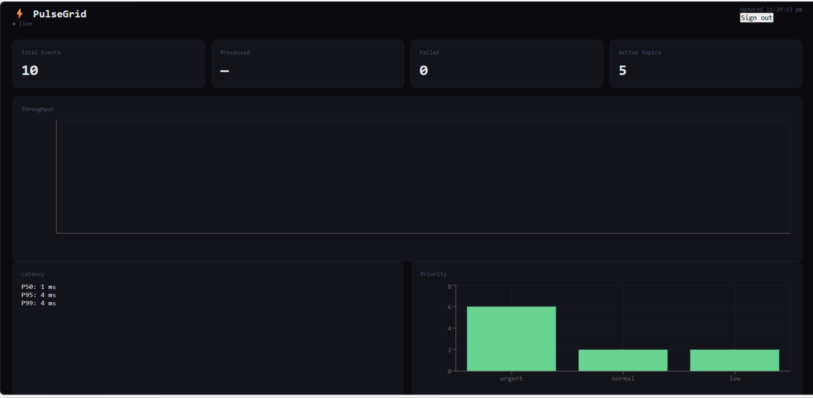
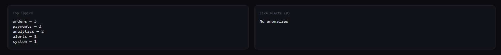
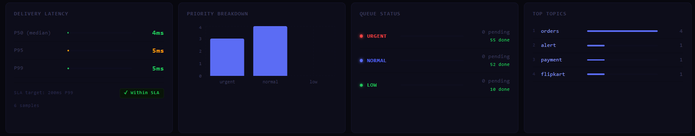

# ⚡ PulseGrid — Distributed Event Delivery Platform

> A production-grade real-time messaging infrastructure with priority-based
> delivery, offline sync, AI-powered routing, and live observability.



## What This Is

PulseGrid is **not a chat app**. It is the event delivery layer that powers
systems like order tracking, payment alerts, and driver dispatch — the same
infrastructure pattern used by Swiggy, Razorpay, and Uber Eats internally.

Any service (producer) can publish a typed event to a topic. Any user
(subscriber) receives it instantly over WebSocket. The system guarantees
delivery even when subscribers are offline, routes events by priority, and
surfaces anomalies in real time.

---

## Architecture

```
Producer → API Gateway → Priority Classifier
                              ↓
                    BullMQ Queue (urgent/normal/low)
                              ↓
                    Queue Worker → Redis Pub/Sub
                                        ↓
                              WebSocket Server → Online Subscribers
                                        ↓
                              Offline Sync Engine → Offline Queue (PostgreSQL)
                                                         ↓
                                                   Replay on Reconnect
```

---

## Key Engineering Features

### Priority Queue Engine
Three isolated BullMQ queues backed by Redis. Events are classified as
`urgent`, `normal`, or `low` — each processed by workers with different
concurrency limits (20 / 10 / 3). Urgent events are never blocked by
low-priority backlog.

### AI Priority Classifier
A two-path classifier assigns priority without manual tagging. The fast path
matches topic names against known patterns. The slow path scores the event
payload using weighted keyword matching and numeric heuristics (transaction
amount, status fields). Every decision returns a `source` and `confidence`
score for full auditability.

### Offline Sync Engine
When a subscriber disconnects, missed events are queued idempotently in
PostgreSQL (ON CONFLICT DO NOTHING). On reconnect, the WebSocket server
sends `SYNC_START`, replays all missed events in chronological order with a
`replayed: true` flag, then sends `SYNC_COMPLETE`. The queue is cleared only
after all events are confirmed sent — never before.

### Z-Score Anomaly Detection
A rolling 30-minute throughput window is sampled every event. Z-score is
calculated against the window mean and standard deviation. Z ≥ 2.0 triggers
a `warning` alert broadcast over WebSocket to all connected clients. Z ≥ 3.0
triggers `critical`. Alerts are stored in Redis and surfaced in the dashboard.

### Real-Time Analytics Dashboard
React dashboard consuming 5 analytics endpoints. Throughput chart (events/min
over 30 min), P50/P95/P99 delivery latency, priority and topic breakdown.
Anomaly alerts arrive via WebSocket — the banner appears without polling or
page refresh.

---

## Tech Stack

| Layer       | Technology                        |
|-------------|-----------------------------------|
| Backend     | Node.js, Express.js               |
| Real-time   | WebSockets (ws), Redis Pub/Sub    |
| Queue       | BullMQ (Redis-backed)             |
| Database    | PostgreSQL (with JSONB payloads)  |
| Cache       | Redis (ioredis)                   |
| Frontend    | React, Recharts                   |
| Auth        | JWT, bcrypt (12 salt rounds)      |
| Container   | Docker, docker-compose            |

---

## Quick Start

**Prerequisites:** Docker Desktop

```bash
git clone https://github.com/AkashDeolikar/pulsegrid.git
cd pulsegrid
docker-compose up --build
```

Backend runs at `http://localhost:3000`
Dashboard runs at `http://localhost:3001` (start separately — see below)

---

## API Reference

### Auth
| Method | Endpoint              | Description         |
|--------|-----------------------|---------------------|
| POST   | /api/auth/register    | Register new user   |
| POST   | /api/auth/login       | Login, returns JWT  |
| GET    | /api/auth/me          | Get own profile     |

### Events
| Method | Endpoint              | Description                        |
|--------|-----------------------|------------------------------------|
| POST   | /api/events/publish   | Publish event (AI classifies priority) |

### Subscriptions
| Method | Endpoint                      | Description         |
|--------|-------------------------------|---------------------|
| POST   | /api/subscriptions/subscribe  | Subscribe to topic  |
| DELETE | /api/subscriptions/unsubscribe| Unsubscribe         |
| GET    | /api/subscriptions/my         | List my topics      |

### Analytics
| Method | Endpoint                  | Description              |
|--------|---------------------------|--------------------------|
| GET    | /api/analytics/overview   | System-wide stats        |
| GET    | /api/analytics/throughput | Events/min time series   |
| GET    | /api/analytics/latency    | P50/P95/P99 latency      |
| GET    | /api/analytics/anomalies  | Recent spike detections  |
| GET    | /api/analytics/topics     | Per-topic breakdown      |

---

## WebSocket Events

Connect: `ws://localhost:3000?token=YOUR_JWT`

| Type            | Direction      | Description                     |
|-----------------|----------------|---------------------------------|
| CONNECTED       | Server → Client| Acknowledge connection          |
| EVENT           | Server → Client| Delivered event payload         |
| SYNC_START      | Server → Client| Offline replay starting         |
| SYNC_COMPLETE   | Server → Client| Replay finished, count included |
| ANOMALY_ALERT   | Server → Client| Z-score spike detected          |
| PING / PONG     | Both           | Heartbeat keepalive             |

---

## Screenshots

### Live Dashboard with Anomaly Alert


### Throughput Spike


### Offline Sync Terminal


---

## Design Decisions & Trade-offs

**Why ws over Socket.io?**
ws is the raw WebSocket implementation — no fallbacks, no magic. Using it
demonstrates understanding of the protocol itself. Socket.io hides the
distributed systems complexity this project is designed to show.

**Why three separate BullMQ queues instead of one with priority numbers?**
Separate queues mean separate worker pools. A backlog of 50,000 low-priority
analytics events has zero impact on urgent payment delivery. One shared queue,
even with priority numbers, still shares worker threads.

**Why write to PostgreSQL before publishing to Redis?**
Write-ahead durability. If Redis publish fails, the event exists in the
database and can be retried. If Redis is published first and the DB write
fails, a ghost event is delivered with no audit trail.

**Why clear the offline queue after delivery, not before?**
If the queue is cleared before delivery and the WebSocket drops mid-replay,
those events are permanently lost. Clear-after is the only safe order.

---

## Author

Akash Deolikar · [GitHub](https://github.com/AkashDeolikar) · [LinkedIn](https://in.linkedin.com/in/akash-deolikar-591122222)

Built as a demonstration of distributed systems engineering for backend
and platform engineering roles.