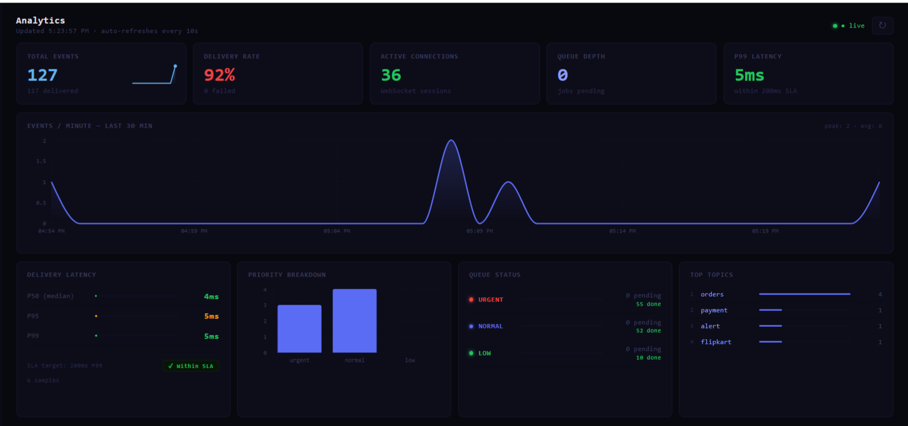
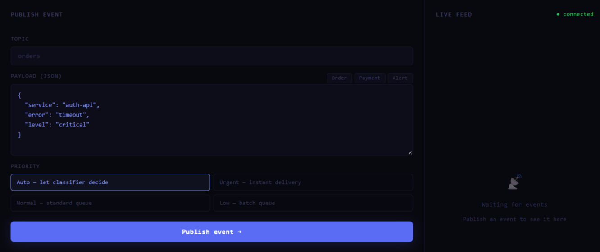
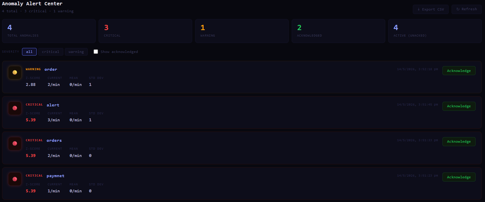

<!-- # ⚡ PulseGrid — Distributed Event Delivery Platform


> A production-grade real-time messaging infrastructure with priority-based
> delivery, offline sync, AI-powered routing, and live observability.


## What This Is

PulseGrid is **not a chat app**. It is the event delivery layer that powers
systems like order tracking, payment alerts, and driver dispatch — the same
infrastructure pattern used by Swiggy, Razorpay, and Uber Eats internally.

Any service (producer) can publish a typed event to a topic. Any user
(subscriber) receives it instantly over WebSocket. The system guarantees
delivery even when subscribers are offline, routes events by priority, and
surfaces anomalies in real time.

---

## Architecture

```
Producer → API Gateway → Priority Classifier
                              ↓
                    BullMQ Queue (urgent/normal/low)
                              ↓
                    Queue Worker → Redis Pub/Sub
                                        ↓
                              WebSocket Server → Online Subscribers
                                        ↓
                              Offline Sync Engine → Offline Queue (PostgreSQL)
                                                         ↓
                                                   Replay on Reconnect
```

---

## Key Engineering Features

### Priority Queue Engine
Three isolated BullMQ queues backed by Redis. Events are classified as
`urgent`, `normal`, or `low` — each processed by workers with different
concurrency limits (20 / 10 / 3). Urgent events are never blocked by
low-priority backlog.

### AI Priority Classifier
A two-path classifier assigns priority without manual tagging. The fast path
matches topic names against known patterns. The slow path scores the event
payload using weighted keyword matching and numeric heuristics (transaction
amount, status fields). Every decision returns a `source` and `confidence`
score for full auditability.

### Offline Sync Engine
When a subscriber disconnects, missed events are queued idempotently in
PostgreSQL (ON CONFLICT DO NOTHING). On reconnect, the WebSocket server
sends `SYNC_START`, replays all missed events in chronological order with a
`replayed: true` flag, then sends `SYNC_COMPLETE`. The queue is cleared only
after all events are confirmed sent — never before.

### Z-Score Anomaly Detection
A rolling 30-minute throughput window is sampled every event. Z-score is
calculated against the window mean and standard deviation. Z ≥ 2.0 triggers
a `warning` alert broadcast over WebSocket to all connected clients. Z ≥ 3.0
triggers `critical`. Alerts are stored in Redis and surfaced in the dashboard.

### Real-Time Analytics Dashboard
React dashboard consuming 5 analytics endpoints. Throughput chart (events/min
over 30 min), P50/P95/P99 delivery latency, priority and topic breakdown.
Anomaly alerts arrive via WebSocket — the banner appears without polling or
page refresh.

---

## Tech Stack

| Layer       | Technology                        |
|-------------|-----------------------------------|
| Backend     | Node.js, Express.js               |
| Real-time   | WebSockets (ws), Redis Pub/Sub    |
| Queue       | BullMQ (Redis-backed)             |
| Database    | PostgreSQL (with JSONB payloads)  |
| Cache       | Redis (ioredis)                   |
| Frontend    | React, Recharts                   |
| Auth        | JWT, bcrypt (12 salt rounds)      |
| Container   | Docker, docker-compose            |

---

## Quick Start

**Prerequisites:** Docker Desktop

```bash
git clone https://github.com/AkashDeolikar/pulsegrid.git
cd pulsegrid
docker-compose up --build
```

Backend runs at `http://localhost:3000`
Dashboard runs at `http://localhost:3001` (start separately — see below)

---

## API Reference

### Auth
| Method | Endpoint              | Description         |
|--------|-----------------------|---------------------|
| POST   | /api/auth/register    | Register new user   |
| POST   | /api/auth/login       | Login, returns JWT  |
| GET    | /api/auth/me          | Get own profile     |

### Events
| Method | Endpoint              | Description                        |
|--------|-----------------------|------------------------------------|
| POST   | /api/events/publish   | Publish event (AI classifies priority) |

### Subscriptions
| Method | Endpoint                      | Description         |
|--------|-------------------------------|---------------------|
| POST   | /api/subscriptions/subscribe  | Subscribe to topic  |
| DELETE | /api/subscriptions/unsubscribe| Unsubscribe         |
| GET    | /api/subscriptions/my         | List my topics      |

### Analytics
| Method | Endpoint                  | Description              |
|--------|---------------------------|--------------------------|
| GET    | /api/analytics/overview   | System-wide stats        |
| GET    | /api/analytics/throughput | Events/min time series   |
| GET    | /api/analytics/latency    | P50/P95/P99 latency      |
| GET    | /api/analytics/anomalies  | Recent spike detections  |
| GET    | /api/analytics/topics     | Per-topic breakdown      |

---

## WebSocket Events

Connect: `ws://localhost:3000?token=YOUR_JWT`

| Type            | Direction      | Description                     |
|-----------------|----------------|---------------------------------|
| CONNECTED       | Server → Client| Acknowledge connection          |
| EVENT           | Server → Client| Delivered event payload         |
| SYNC_START      | Server → Client| Offline replay starting         |
| SYNC_COMPLETE   | Server → Client| Replay finished, count included |
| ANOMALY_ALERT   | Server → Client| Z-score spike detected          |
| PING / PONG     | Both           | Heartbeat keepalive             |

---

## Screenshots

### Live Dashboard with Anomaly Alert


### Throughput Spike


### Offline Sync Terminal


---

## Design Decisions & Trade-offs

**Why ws over Socket.io?**
ws is the raw WebSocket implementation — no fallbacks, no magic. Using it
demonstrates understanding of the protocol itself. Socket.io hides the
distributed systems complexity this project is designed to show.

**Why three separate BullMQ queues instead of one with priority numbers?**
Separate queues mean separate worker pools. A backlog of 50,000 low-priority
analytics events has zero impact on urgent payment delivery. One shared queue,
even with priority numbers, still shares worker threads.

**Why write to PostgreSQL before publishing to Redis?**
Write-ahead durability. If Redis publish fails, the event exists in the
database and can be retried. If Redis is published first and the DB write
fails, a ghost event is delivered with no audit trail.

**Why clear the offline queue after delivery, not before?**
If the queue is cleared before delivery and the WebSocket drops mid-replay,
those events are permanently lost. Clear-after is the only safe order.

---

## Author

Akash Deolikar · [GitHub](https://github.com/AkashDeolikar) · [LinkedIn](https://in.linkedin.com/in/akash-deolikar-591122222)

Built as a demonstration of distributed systems engineering for backend
and platform engineering roles. -->


# ⚡ PulseGrid — Distributed Event Delivery Platform

[](https://github.com/AkashDeolikar/pulsegrid/actions/workflows/ci.yml)


> A production-grade real-time event delivery infrastructure with priority-based
> routing, offline sync, AI-powered classification, and live observability.

---

## 🌐 Live Demo

| | URL |
|---|---|
| **Dashboard** | https://pulsegrid-dashboard.vercel.app |
| **API**        | https://pulsegrid-production.up.railway.app |
| **Health**     | https://pulsegrid-production.up.railway.app/health |

> Register a free account and try it live. Publish an event, watch it arrive
> in the live feed in real time, see the AI classifier assign a priority.

---

## What This Is

PulseGrid is **not a chat app**. It is the event delivery layer that powers
systems like order tracking, payment alerts, and driver dispatch — the same
infrastructure pattern used internally at companies like Swiggy, Razorpay,
and Uber Eats.

Any authenticated producer publishes a typed event to a topic. Any subscriber
receives it instantly over WebSocket. The system guarantees delivery even when
subscribers are offline, routes events by priority, and surfaces anomalies in
real time.

---

## Architecture

```
Producer → API Gateway → AI Priority Classifier
                              ↓
                    ┌─────────────────────┐
                    │  BullMQ Queue Engine │
                    │  urgent (20 workers) │
                    │  normal (10 workers) │
                    │  low    ( 3 workers) │
                    └─────────────────────┘
                              ↓
                    Queue Worker → Redis Pub/Sub
                                        ↓
                    ┌───────────────────────────────┐
                    │        WebSocket Server        │
                    │  fan-out to all subscribers    │
                    └───────────────────────────────┘
                         ↓               ↓
                   Online users    Offline users
                   (instant)       → offline_queue (PostgreSQL)
                                   → replay on reconnect
```

---

## Key Engineering Features

### ⚡ Real-Time Delivery
WebSocket server backed by Redis pub/sub. Events fan out to all subscribers
across any number of server instances — horizontally scalable from day one.

### 🧠 AI Priority Classifier
Two-path classifier auto-assigns priority without manual tagging. Fast path
matches topic name against known patterns (O(1)). Slow path scores payload
using weighted keyword matching and numeric heuristics. Every decision returns
source and confidence for full auditability.

### 📦 3-Tier Priority Queue
Three isolated BullMQ queues (urgent/normal/low) with separate worker pools
(20/10/3 concurrency). A backlog of 50,000 low-priority analytics events has
zero impact on urgent payment delivery.

### 🔄 Offline Sync Engine
Disconnected subscribers get events queued idempotently in PostgreSQL
(ON CONFLICT DO NOTHING). On reconnect: SYNC_START → events replayed in order
with replayed:true flag → SYNC_COMPLETE. Queue cleared only after delivery.

### 📊 Z-Score Anomaly Detection
Rolling 30-minute throughput window. Z ≥ 2.0 = warning alert broadcast over
WebSocket to all connected clients. Z ≥ 3.0 = critical. Same statistical
approach used by Datadog and CloudWatch.

### 🖥 Live Analytics Dashboard
11-page React dashboard: event publisher, live feed, event history,
subscription management, anomaly center, queue console, topic explorer,
API playground, user settings, and analytics.

---

## Tech Stack

| Layer       | Technology                              |
|-------------|----------------------------------------|
| Backend     | Node.js 20, Express.js                 |
| Real-time   | WebSockets (ws), Redis Pub/Sub         |
| Queue       | BullMQ (Redis-backed, 3-tier)          |
| Database    | PostgreSQL 16 (JSONB payloads, indexed)|
| Cache       | Redis 7 (ioredis)                      |
| Frontend    | React 18, Recharts                     |
| Auth        | JWT, bcrypt (12 salt rounds)           |
| Container   | Docker, docker-compose                 |
| CI/CD       | GitHub Actions                         |
| Deployment  | Railway (backend), Vercel (frontend)   |

---

## Quick Start (Docker — one command)

**Prerequisites:** Docker Desktop

```bash
git clone https://github.com/AkashDeolikar/pulsegrid.git
cd pulsegrid
docker-compose up --build
```

| Service   | URL                          |
|-----------|------------------------------|
| Backend   | http://localhost:3000        |
| Health    | http://localhost:3000/health |
| Dashboard | http://localhost:3001 (start separately) |

```bash
# Dashboard (separate terminal)
cd pulsegrid-dashboard
npm install && npm start
```

---

## API Reference

### Auth
| Method | Endpoint                | Description               |
|--------|-------------------------|---------------------------|
| POST   | /api/auth/register      | Register new user         |
| POST   | /api/auth/login         | Login, returns JWT        |
| GET    | /api/auth/me            | Get own profile           |
| PATCH  | /api/auth/profile       | Update username           |
| PATCH  | /api/auth/password      | Change password           |

### Events
| Method | Endpoint                  | Description                        |
|--------|---------------------------|------------------------------------|
| POST   | /api/events/publish       | Publish event (AI assigns priority)|
| GET    | /api/events               | List events (filters + pagination) |
| GET    | /api/events/:id           | Get single event                   |
| POST   | /api/events/:id/retry     | Retry a failed event               |

### Subscriptions
| Method | Endpoint                          | Description         |
|--------|-----------------------------------|---------------------|
| POST   | /api/subscriptions/subscribe      | Subscribe to topic  |
| DELETE | /api/subscriptions/unsubscribe    | Unsubscribe         |
| GET    | /api/subscriptions/my             | List my topics      |

### Analytics
| Method | Endpoint                    | Description              |
|--------|-----------------------------|--------------------------|
| GET    | /api/analytics/overview     | System-wide stats        |
| GET    | /api/analytics/throughput   | Events/min time series   |
| GET    | /api/analytics/latency      | P50/P95/P99 latency      |
| GET    | /api/analytics/anomalies    | Recent spike detections  |
| GET    | /api/analytics/topics       | Per-topic breakdown      |

---

## WebSocket Events

Connect: `ws://localhost:3000?token=YOUR_JWT`

| Type            | Direction       | Description                       |
|-----------------|-----------------|-----------------------------------|
| CONNECTED       | Server → Client | Acknowledge connection            |
| EVENT           | Server → Client | Delivered event payload           |
| SYNC_START      | Server → Client | Offline replay starting           |
| SYNC_COMPLETE   | Server → Client | Replay finished, count included   |
| ANOMALY_ALERT   | Server → Client | Z-score spike detected            |
| PING / PONG     | Both            | Heartbeat keepalive               |

---

## Design Decisions & Trade-offs

**Why ws over Socket.io?**
ws is the raw WebSocket implementation. Socket.io adds rooms, namespaces,
and fallbacks that this project implements explicitly — using Socket.io would
hide the distributed systems complexity it exists to demonstrate.

**Why three separate BullMQ queues instead of one with priority numbers?**
Separate queues mean separate worker pools. A backlog of low-priority analytics
jobs has zero impact on urgent payment delivery. One shared queue, even with
priority numbers, shares worker threads.

**Why write to PostgreSQL before publishing to Redis?**
Write-ahead durability. If Redis publish fails, the event exists in the
database and can be retried. Publishing to Redis first and failing the DB
write creates a ghost event — delivered with no audit trail.

**Why clear the offline queue after delivery, not before?**
If cleared before delivery and the WebSocket drops mid-replay, those events
are permanently lost. Clear-after-delivery means: on the next reconnect,
replay starts again from the beginning. The replayed:true flag lets clients
deduplicate.

**Why Z-score over a fixed threshold for anomaly detection?**
A fixed threshold fails in dynamic systems — it false-alarms during normal
growth and misses anomalies in low-traffic periods. Z-score adapts to the
system's own baseline. The same statistical approach is used by Datadog,
New Relic, and AWS CloudWatch.

**Why mock Redis/BullMQ but use a real PostgreSQL in integration tests?**
PostgreSQL tests verify real SQL — joins, constraints, ON CONFLICT behaviour,
and the schema itself. These are the things most likely to break in unexpected
ways. Redis operations in tests are simple enough that mocks give full
confidence. BullMQ workers spawn background processes that interfere with
test isolation.

---

## Screenshots

### Live Dashboard


### Event Publisher + Live Feed


### Anomaly Alert


### Offline Sync Terminal


---

## Test Suite

```bash
cd pulsegrid
npm test              # run all tests
npm run test:coverage # with coverage report
```

| File | Tests | Type |
|------|-------|------|
| priority.classifier.test.js | 13 | Unit |
| anomaly.detector.test.js    |  9 | Unit |
| auth.service.test.js        |  7 | Unit |
| auth.test.js                |  8 | Integration |
| events.test.js              |  6 | Integration |
| events.list.test.js         | 13 | Integration |
| events.retry.test.js        |  6 | Integration |
| auth.profile.test.js        | 14 | Integration |

**Total: 76 tests · 75%+ line coverage**

---

## Author

**Akash Deolikar** · B.E. Computer Science
[GitHub](https://github.com/AkashDeolikar) ·
[LeetCode](https://leetcode.com/u/akash_deolikar/) ·
[LinkedIn](#)

Built as a demonstration of distributed systems engineering for backend
and platform engineering roles at companies like Amazon, Razorpay, and
ServiceNow.

---

*"I designed a distributed messaging system with priority-based delivery,
Redis pub/sub for low-latency fan-out, an offline sync mechanism to ensure
reliability, and Z-score anomaly detection for real-time observability."*